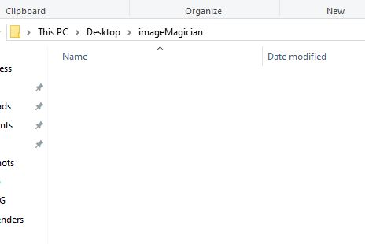
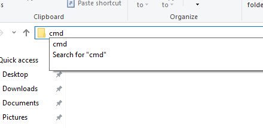
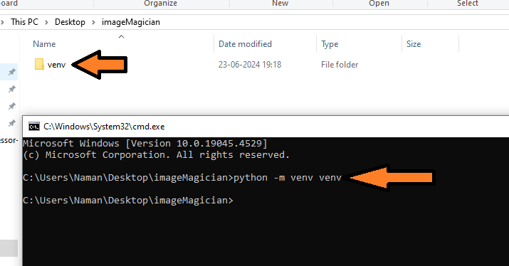
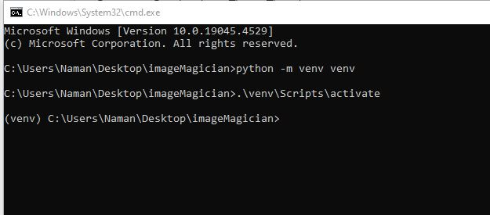
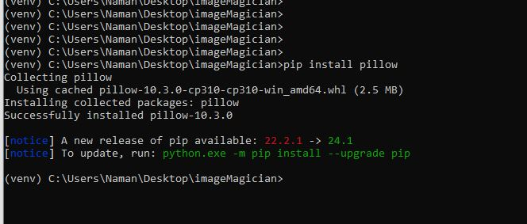
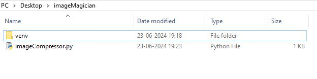
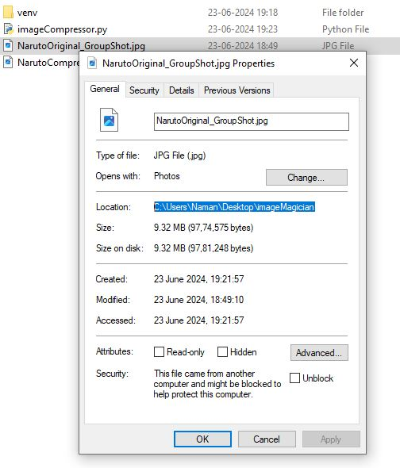
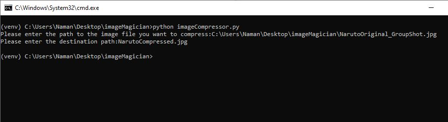


**Python and Pillow** provide us a very simple way to compress/reduce in size, large image files with almost zero loss of image clarity. In true python fashion, most of the heavy lifting is already done by the pillow and graphic libraries internally, we just need to call a few functions. 

As almost everyone of us deals with images, this provides a very useful feature to us to save some space and bandwidth. In my experience it reduces large DSLR images to almost a third in size, from 12 mb to approx 3mb, with zero loss in clarity.

###### This does not require any programming knowledge whatsoever, however some technical terms might confuse you but you should be fine just following the instructions.


### Pre-requiesites 

Please Install [Pythons latest version](https://www.python.org/), using python's home page. The installation is really straight forward, the same as installing any other software on your pc.


### Lets Get Started

- Create a new folder desktop and give it any name, I'm gonna call it ImageMagician


- Go into the folder, click on the address bar and type cmd, to open the folder into your command line terminal


- Create a virtual environment in this folder, using the command below 

```python
python -m venv venv
```

This step isn't necessary, but its a good habit to create virtual environments when doing a project in python

- Once done, activate the virtual environment, using the command below
```
.\venv\scripts\activate    -------> windows
venv/bin/activate          -------> linux  ( if you're using linux you should already know this shit)
```
Now it'll show the virtual env in your command line like in the image below


- Lets install pillow using the command below
```
pip install pillow
```


And now the stage is set

### The Script

Like I said in the intro, we don't have to do much ourselves. Most of they heavy lifting is already done by python and pillow library. Thank the lord for open source contributors.
We just need to call the right function, and give it the right parameters, which is 99% of programming if you think about it. Anyways, here's the script below in its entirety. Its not long!! Its almost trivial.

```python
from PIL import Image
import os

source_image_path = input("Please enter the path to the image file you want to compress:")
image =  Image.open(source_image_path)
size = image.size
exif = image.getexif()

final_photo_full = image.resize(size,resample = Image.Resampling.BILINEAR)
target_path = input("Please enter the destination path:")
final_photo_full.save(target_path,optimize=True,exif=exif)
```
Copy paste this into notepad, save it in the same folder on your desktop, give it name like imageCompressor.py
Thats it.




### Saving Some Space

Its time to do some compression. Here's a [huge Naruto Wallpaper](https://drive.google.com/file/d/1AYPZaW33HrtO2APFFDRulYU18t55a6vK/view?usp=sharing) thats around 9 MB in size. Lets try to compress that and see how much disk space we can save. 


Lets run this script, in your command line write. 

```
python imageCompressor.py
```

It will ask you to input the path to an image file. You can get that for any file by going into properties and getting the path, screenshot below for reference.

Paste the path into the command line, of course add the name of the file after it. If the file is in the same folder as the script you can just write the file name.


After that it'll ask for a target path. You can give it any target, or just give a simple name like I have done so and it'll save in the same folder the script is running


### AND WE ARE DONE

Lets quickly compare the two images.
The compressed image size is 5.7 mb, compared to 9.5 mb of the original, so almost a 40% reduction.

I'll zoom onto Naruto's hands in both images and take a screen capture.


#### To be honest I see no difference, lets try another area to zoom in.


Looking the same fancy in both.

#### That pretty much sums it up. There are a lot of other parameters we can pass and some different techniques to reduce the size even further, but this is the cleanest, fastest way of doing it for free without any nonsense.


