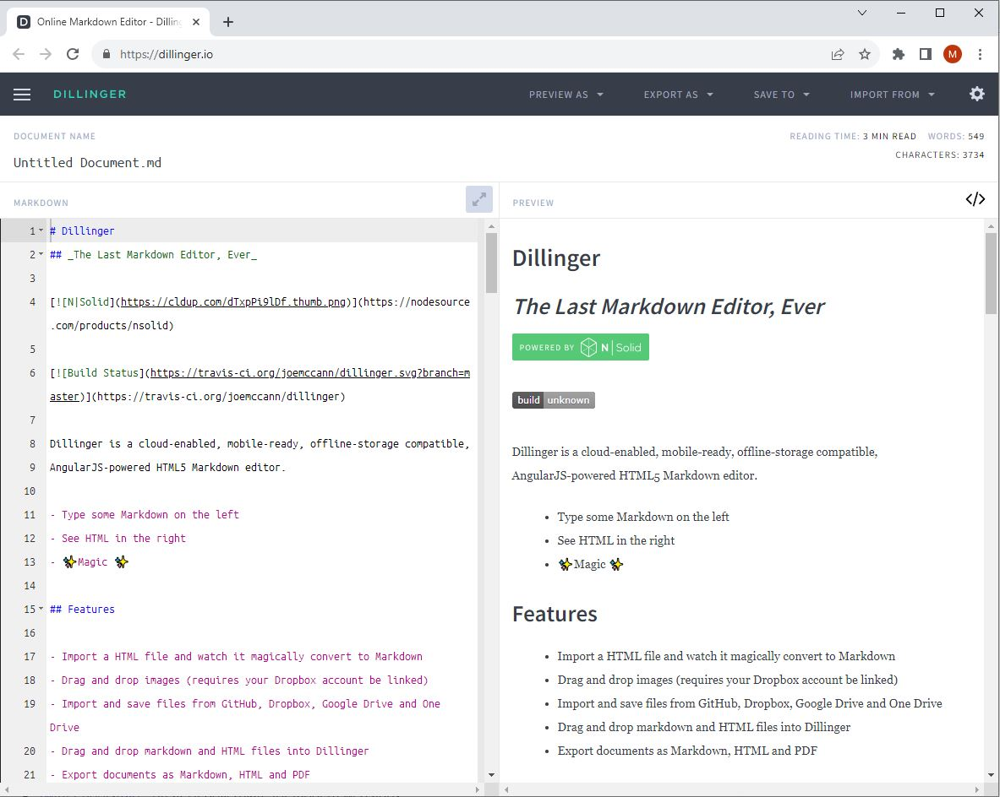


**Markdown** is a simple way to make text look nice without fancy editors or HTML. It adds headings, lists, and links to plain text, and it works the same on different devices.


## What is Markdown?

**Markdown** is a *lightweight markup language* created by *John Gruber* in 2004. It serves as a tool for enhancing plain text documents with formatting elements and has grown to become one of the most widely adopted markup languages globally.

In contrast to _WYSIWYG_ (What You See Is What You Get) editors like *Microsoft Word*, where formatting changes are immediately visible through button clicks, *Markdown* operates differently. When working with *Markdown*, you incorporate specific syntax into the text to indicate how words and phrases should appear.

For instance, a hashtag before a line denotes a heading (e.g., `# Heading One`), and enclosing a phrase with two asterisks on each side signifies bold text (e.g., `**this text is bold**`). Adjusting to *Markdown* syntax might take some time, especially for those accustomed to WYSIWYG applications. The screenshot below illustrates a *Markdown*-formatted file.



Adding *Markdown* formatting to a plaintext file can be done through a text editor application, or you can opt for numerous *Markdown* applications compatible with macOS, Windows, Linux, iOS, and Android. Additionally, various web-based applications cater specifically to *Markdown* writing. An example is [*GitHub*](https://github.com/), which uses an extension of the standard markdown, introducing additional features and enhacements tailored to the GitHub platform's needs.

While real-time previewing may not be available in all applications, Gruber assures that *Markdown* syntax prioritizes readability and unobtrusiveness. Consequently, even if the *Markdown* file isn't rendered, the text remains easily readable.

> The primary objective of Markdown's formatting syntax is to maximize readability. The concept is that a document formatted in Markdown should be effortlessly publishable as plain text, without giving the impression that it has been annotated with tags or formatting instructions.

## Getting Started with Markdown

The most effective way to acquaint yourself with Markdown is by actively using it, and fortunately, this is now more accessible than ever, thanks to various free tools.

No need for downloads; numerous online Markdown editors allow you to experiment with Markdown writing effortlessly. One notable option is [**Dillinger**](https://dillinger.io/), a highly regarded online Markdown editor. Simply visit the site, start typing in the left pane, and witness a live preview of the formatted document in the right pane.



For optimal learning, consider keeping the Dillinger website open while reading through this series of documents. This way, you can immediately practice the syntax as you encounter it. Once you've gained familiarity with Markdown, you might opt for a desktop or mobile Markdown application for a more versatile writing experience.

## Why Choose Markdown Over WYSIWYG Editors?

If you've ever wondered why people prefer Markdown over WYSIWYG editors, the answer lies in several compelling reasons:

- **Versatility:** Markdown isn't limited to a specific use case. It's employed for creating websites, documents, notes, books, presentations, email messages, and technical documentation.

- **Portability:** Markdown files can be opened with virtually any application. If you ever decide to switch Markdown applications, you can easily import your files without being tied to a proprietary file format, unlike word processing applications such as Microsoft Word.

- **Platform Independence:** Markdown works seamlessly on any device running any operating system. Its compatibility extends across diverse computing environments.

- **Future-Proofing:** Markdown ensures future accessibility. Even if the application you're using becomes obsolete, you can still read your Markdown-formatted text using a basic text editing application. This is particularly crucial for preserving long-term documents like books and university theses.

- **Ubiquity:** Markdown enjoys widespread support. Major platforms like Reddit and GitHub endorse Markdown, and numerous desktop and web-based applications integrate it into their features.

These qualities collectively make Markdown a preferred choice for individuals and communities across various domains.

## What's Markdown Good For?

Markdown serves as a fast and straightforward tool for various purposes, including note-taking, website content creation, and document production.

Learning Markdown syntax is quick, and its versatility allows for writing across diverse platforms. While commonly used for web content creation, Markdown is applicable to formatting tasks ranging from email messages to grocery lists.


### Websites

Markdown, designed for the web, finds ample support in applications tailored for website content creation. For a straightforward website creation experience using Markdown files, consider [blot.im](https://blot.im/). Alternatively, for those familiar with HTML, CSS, and version control, [Jekyll](https://jekyllrb.com/), a popular static site generator, offers flexibility. Also, Github offers free hosting using Jekyll at [GitHub Pages](https://pages.github.com/). Wanna know more about Static Website Generators then visit <https://jamstack.org/generators/>. 

Explore [Ghost](https://ghost.org/) if you prefer a content management system (CMS) for your website. WordPress users can enjoy Markdown support for websites hosted on [WordPress.com](https://wordpress.com/), while self-hosted WordPress sites can use the [Jetpack plugin](https://jetpack.com/). Want to know about **Headless CMSes** then visit <https://jamstack.org/headless-cms/>.


### Documents

While lacking the complexities of word processors, Markdown is suitable for creating basic documents like assignments and letters. Markdown document authoring applications, such as:

- **Mac:** [MacDown](https://macdown.uranusjr.com/), [iA Writer](https://ia.net/writer/), or [Marked 2](https://marked2app.com/)
- **iOS / Android:** [iA Writer](https://ia.net/writer/)
- **Windows:** [ghostwriter](https://wereturtle.github.io/ghostwriter/) or [Markdown Monster](https://markdownmonster.west-wind.com/)
- **Linux:** [ReText](https://github.com/retext-project/retext) or [ghostwriter](https://wereturtle.github.io/ghostwriter/)
- **Web:** [Dillinger](https://dillinger.io/) or [StackEdit](https://stackedit.io/)

*Tip: [iA Writer](https://ia.net/writer/) provides templates for previewing, printing, and exporting Markdown-formatted documents. For example, the "Academic – MLA Style" template indents paragraphs and adds double sentence spacing.*

### Notes

In nearly every way, Markdown is the ideal syntax for taking notes. Sadly, Evernote and OneNote, two of the most popular note applications, don’t currently support Markdown. The good news is that several other note applications do support Markdown:

- [Obsidian](https://obsidian.md/): A popular Markdown note-taking application loaded with features.
- [Simplenote](https://simplenote.com/): A free, barebones note-taking application available for every platform.
- [Notable](https://notable.md/): A note-taking application that runs on a variety of platforms.
- [Bear](https://bear.app/): An Evernote-like application available for Mac and iOS devices. It doesn’t exclusively use Markdown by default, but you can enable Markdown compatibility mode.
- [Joplin](https://joplinapp.org/): A note-taking application that respects your privacy. It’s available for every platform.
- [Boostnote](https://boostnote.io/): An “open source note-taking app designed for programmers.”

If you can’t part with Evernote, check out [Marxico](https://marxi.co/), a subscription-based Markdown editor for Evernote, or use [Markdown Here](https://markdown-here.com/) with the Evernote website.

### Books

Looking to self-publish a novel? Try [Leanpub](https://leanpub.com/), a service that takes your Markdown-formatted files and turns them into an electronic book. Leanpub outputs your book in PDF, EPUB, and MOBI file format. If you’d like to create paperback copies of your book, you can upload the PDF file to another service such as [Kindle Direct Publishing](https://kdp.amazon.com/). To learn more about writing and self-publishing a book using Markdown, [read this blog post](https://leanpub.com/markua/read).

### Presentations

Believe it or not, you can generate presentations from Markdown-formatted files. Creating presentations in Markdown takes a little getting used to, but once you get the hang of it, it’s a lot faster and easier than using an application like PowerPoint or Keynote. [Remark](https://github.com/gnab/remark) is a popular browser-based Markdown slideshow tool, as are [Cleaver](https://github.com/jdan/cleaver) and [Marp](https://github.com/marp-team/marp).


### Documentation

[GitHub](https://github.com), one of the most widely used version control platforms, supports Markdown for documentation in repositories. Markdown files (.md) can be used for READMEs, wikis, and other documentation within GitHub projects. Similarly [GitLab](https://about.gitlab.com/) and [BitBucket](https://bitbucket.org/) also use Markdown.

[Visual Studio Code](https://code.visualstudio.com/), a popular source-code editor, supports Markdown for documentation within projects. Markdown files can be used for creating READMEs, writing documentation, and more.

[Jupyter Notebooks](https://jupyter.org/), an open-source web application, supports Markdown cells for creating rich-text documentation alongside executable code. This makes it a popular choice in data science and research. 

## Popular Markdown Extensions

Markdown, being a lightweight markup language, has been extended with additional features to enhance its capabilities. These extensions offer enhanced functionality and cater to specific needs, making Markdown even more versatile in various contexts. Feel free to explore these extensions based on your specific requirements!
Here are some popular Markdown extensions:

### GitHub Flavored Markdown (GFM)

GitHub's extension of Markdown, introducing features like task lists, tables, and code fencing for better code representation.

**Example:**

```markdown
- [x] Task 1
- [ ] Task 2
```

### CommonMark

A standardized and highly compatible Markdown specification, aiming to create a consistent Markdown experience across different platforms.

**Example:**
```markdown
# Heading
*Italic* **Bold**
```

### Markdown Extra

Adds additional features such as tables, fenced code blocks, and more, extending the basic Markdown syntax.

**Example:**

```markdown
| Item | Description |
| ---- | ----------- |
| A    | Apple       |
| B    | Banana      |
```

### Pandoc Markdown

Used by Pandoc, a universal document converter, this extension includes features like definition lists and tables without header rows.

**Example:**

```markdown
Term 1
:   Definition 1

Term 2
:   Definition 2
```

### Footnotes

Enables the creation of footnotes in Markdown documents, providing a way to add additional information or citations.

```markdown
Here is a sentence with a footnote.[^1]

[^1]: This is the footnote text.
```

### Mathjax

Allows the rendering of mathematical equations using MathJax syntax, catering to documents with mathematical content.

```markdown
When \(a \ne 0\), there are two solutions to \(ax^2 + bx + c = 0\)...
```


## Github Flavoured Markdown

Knowing GitHub Flavored Markdown (GFM) is important for several reasons, especially if you are involved in collaborative software development or contribute to projects on GitHub. Here are some key reasons why understanding GFM is valuable:

1. **GitHub Documentation**: GitHub primarily uses GFM for documentation in repositories. Understanding GFM allows you to effectively contribute to project documentation, including README files, wikis, and issue comments.

1. **Enhanced Readability**: GFM introduces additional features that enhance the readability of Markdown documents. For example, GFM supports task lists, tables, and fenced code blocks, making it easier to structure and format content.

1. **Consistency Across GitHub**: Many open-source projects and repositories on GitHub utilize GFM for their documentation. Being familiar with GFM ensures that you can create and maintain content consistently with the platform's standards.

1. **Collaborative Editing**: When collaborating on GitHub repositories, discussions and comments often use GFM. Knowing GFM syntax allows you to communicate effectively with other contributors, format your comments for clarity, and take advantage of features like @mentions.

1. **Pull Requests and Issues**: GFM is commonly used in pull requests and issues to communicate changes, provide context, and discuss code modifications. Understanding GFM enables you to contribute meaningfully to discussions and follow established conventions.

1. **Code Documentation**: GFM is not only for prose but also for code documentation. You can use GFM in Markdown files within your codebase to provide inline code documentation, explanations, and usage examples.

1. **Task Management**: GFM supports task lists, allowing you to create checkboxes in your Markdown documents. This is particularly useful for managing tasks, action items, or tracking progress directly within documentation.

1. **Integration with GitHub Actions**: If you are involved in setting up GitHub Actions for automated workflows, GFM is often used in configuration files. Knowing GFM syntax is beneficial for configuring and customizing GitHub Actions workflows.

### Differences from the Standard Markdown

| **Feature**                  | **Markdown**                              | **GitHub Flavored Markdown (GFM)**                                         |
|------------------------------|-------------------------------------------|--------------------------------------------------------------------------|
| **Task Lists**               | Standard Markdown lacks task list support. | GitHub introduces task lists, allowing checkboxes to mark items complete.|
| **Tables**                   | Basic Markdown has limited table support.  | GitHub enhances tables with headers, column alignment, and more features. |
| **Auto-linking URLs**        | Automatic URL linking is not standard.     | GitHub automatically turns URLs into clickable links.                    |
| **Fenced Code Blocks**       | Fenced code blocks are used, but language specification varies. | GitHub supports fenced code blocks with language specification.     |
| **Strikethrough**            | Standard Markdown lacks strikethrough syntax. | GitHub supports strikethrough text using `~~` notation.                 |
| **Mentions and References**  | No built-in support for mentions or references. | GitHub allows mentioning users and referencing issues/pull requests.  |
| **Disallowed Raw HTML**      | Some Markdown implementations allow raw HTML. | GitHub disallows raw HTML for security reasons.                         |
| **Emoji Support**            | Emoji support is not standard.             | GitHub supports emojis in the text.                                      |
| **Relative Links**           | Behavior may vary for relative links.      | GitHub has consistent rules for handling relative links within repos.  |


